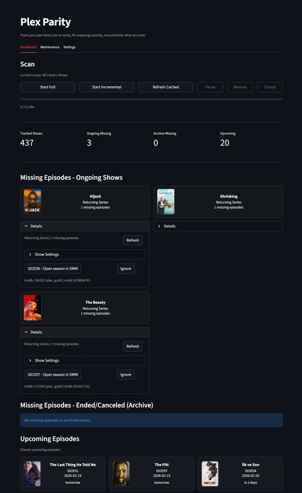

[](https://buymeacoffee.com/lunedor)

# Plex Parity

Plex Parity is a Streamlit app for tracking missing TV episodes in your Plex library by comparing local episodes against TMDB metadata.



## Why Plex Parity?

If you're like me, you find -arr apps overly complex for simple library tracking, 
and you want manual control over release selection (specific subtitled versions, 
quality preferences, etc.). Plex Parity gives you a simple dashboard to spot 
missing episodes and jump directly to Debrid Media Manager to grab what you need.

## Core Features

- Scans TV shows and detects missing aired episodes
- Separates ongoing shows from ended/canceled archive items
- Shows upcoming episode schedule with nearest-airing highlights
- Builds season links for Debrid Media Manager
- Caches scan results for fast reloads
- Auto-promotes cached upcoming episodes to missing once their air date passes
- Supports manual TMDB fixes per show
- Supports ignore/unignore for noisy episodes or whole shows
- Supports scan scope:
  - Entire library
  - Only watchlisted TV shows
- Supports scan mode:
    - Incremental (new/changed/active items)
    - Full re-check (complete library pass)
    - Refresh cached (re-check cached ongoing/missing shows without full library discovery)
  - Also, perform a quick scan for the specific show after adding the missing episode or episodes to avoid scanning the entire library.
- Uses lightweight TMDB checks for common incremental runs and reserves deep season audit for full scans or detected gaps
- Reuses HTTP connections via `requests.Session()` and caches TMDB season responses on disk

## Tech Stack

- Python 3.10+
- Streamlit
- PlexAPI
- Requests (TMDB API)

## Project Structure

- `app.py`: launch entrypoint
- `ui.py`: Streamlit UI and interaction flow
- `backend.py`: Plex/TMDB integration, cache, scan logic
- `requirements.txt`: Python dependencies
- `config.json`: runtime config (auto-created on first run)
- `plex_cache.json`: scan/cache data (auto-created during use)

## Installation

1. Clone the repository:

```bash
git clone https://github.com/Lunedor/plex-parity.git
cd plex-parity
```

2. (Recommended) Create and activate a virtual environment:

Windows (PowerShell):

```powershell
python -m venv .venv
.venv\Scripts\Activate.ps1
```

macOS/Linux:

```bash
python3 -m venv .venv
source .venv/bin/activate
```

3. Install dependencies:

```bash
pip install -r requirements.txt
```

## Configuration

On first run, the app creates `config.json` if missing.

You can configure values in two ways:
- directly in `config.json`
- from the app in `Settings`
- via environment variables (takes precedence over `config.json` when set)

Example `config.json`:

```json
{
  "plex_base_url": "http://127.0.0.1:32400",
  "plex_token": "YOUR_PLEX_TOKEN",
  "tmdb_api_key": "YOUR_TMDB_API_KEY",
  "library_name": "TV Shows",
  "scan_scope": "all_library",
  "include_dmm_link": true,
  "dmm_base_url": "https://debridmediamanager.com",
  "usenet_provider": "none",
  "usenet_api_key": "",
  "usenet_web_url_template": "",
  "usenet_provider_profiles": {}
}
```

`scan_scope` values:
- `all_library`: scans all TV shows in your selected Plex library
- `watchlist_only`: scans only watchlisted TV shows (movies excluded automatically)

Missing link provider values:
- `include_dmm_link`: enable/disable DMM shortcut links
- `usenet_provider`: `none`, `newznab`, `nzbhydra`, `torznab`, `prowlarr`, `torbox`, `jackett`, `custom`
- `usenet_web_url_template`: provider search URL template; supports:
  `{query}`, `{query_url}`, `{title}`, `{title_url}`, `{code}`, `{code_url}`, `{season}`, `{episode}`, `{imdbid}`, `{apikey}`
- `usenet_api_key`: optional; used by template when `{apikey}` is present
- `usenet_provider_profiles`: auto-managed provider-specific saved template/key values

Provider defaults and notes:
- `nzbhydra`: default template `http://127.0.0.1:5076/?query={query_url}`
- `jackett`: default template `http://127.0.0.1:9117/UI/Dashboard#search={query_url}`
- `prowlarr`: default template `http://127.0.0.1:9696/` (adjust to your preferred search route if needed)
- `newznab`, `torznab`, `torbox`: no hardcoded default template, because these are usually service-specific endpoints (not one universal local URL)

## Security

Important: keep tokens out of source control. `config.json`, `plex_cache.json`, and `__pycache__/` are ignored by `.gitignore`.
You can also use environment variables instead of storing credentials on disk:
- `PLEX_BASE_URL`
- `PLEX_TOKEN`
- `TMDB_API_KEY`
- `PLEX_LIBRARY_NAME`
- `PLEX_SCAN_SCOPE`
- `INCLUDE_DMM_LINK`
- `USENET_PROVIDER`
- `USENET_API_KEY`
- `USENET_WEB_URL_TEMPLATE`

## Getting API Credentials

### Plex token

Common options:
- Use Plex Web and inspect network requests for `X-Plex-Token`
- Use existing Plex scripts/tools if you already have a token

### TMDB API key

1. Create/login TMDB account: https://www.themoviedb.org/
2. Create an API key in account settings
3. Put key in `tmdb_api_key`

## Running

```bash
streamlit run app.py
```

Then open the local URL shown in terminal (usually `http://localhost:8501`).

## Usage Flow

1. Open `Settings`, fill required config, save.
2. Go to `Dashboard` and start scan.
3. Review:
   - Ongoing missing shows
   - Archived missing shows
   - Upcoming episodes
4. If mismatch exists, use TMDB override in show settings or `Maintenance`.
5. If needed, recover ignored items from `Maintenance`.
6. Open `Settings` to check for app updates and run an in-app fast-forward update (git clone installs).

## Notes

- Posters are fetched from TMDB and may appear after first successful scan/refresh.
- If you rematch titles in Plex, run a new scan; cache reconciliation handles changes.
- Cached results are shown on app reopen until new scans refresh them.

## Troubleshooting

- `Missing config values`:
  - open `Settings` and complete required fields
- `Failed to connect to Plex`:
  - verify `plex_base_url`, token, and local/network access
- Watchlist scope returns no items:
  - ensure your Plex watchlist contains TV shows
  - ensure watchlisted shows exist in your selected Plex library
- No missing episodes but expected:
  - verify TMDB mapping for the show
  - check ignored items in `Maintenance`

## License

This project is licensed under the MIT License - see the [LICENSE](LICENSE) file for details.
